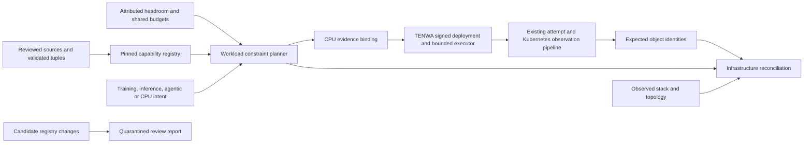

# Infrastructure-aware planning and execution evidence

DIMAGGI connects workload intent to the infrastructure that must support it: compute, topology, network, storage, power, recovery and the software stack. The purpose is to make usable capacity and safe operating decisions visible across those boundaries. A larger accelerator count alone cannot answer whether a workload fits, meets its constraints, or ran on the approved configuration.

The receiver adds versioned capability profiles and attributed observations to the existing source-bound domain models. TENWA consumes the CPU evidence through its signed deployment configuration. The planner supplies compatibility evidence; the existing authority, isolation, revocation and durable-attempt controls determine whether execution may proceed.

## Implemented path



| Boundary | Implemented behavior |
|---|---|
| Hardware generation | Explicit provider, generation, device counting unit and partition; unknown profiles refuse. CPU slots, physical TPU chips, GPUs and MIG instances are distinct units. |
| Compatibility | Exact reviewed tuple across architecture, OS, orchestrator, driver, runtime, framework, device/network plugins and collectives. No inferred cross-product of support ranges. |
| Workload | Separate training, inference, agentic and CPU batch archetypes; explicit precision, per-device memory, topology, isolation, latency and recovery constraints. An agentic label does not establish a benchmark. |
| Capacity | Integer resource reservations across seven dimensions. Declared shared budgets couple pools using the same power feed, storage service or network. Duplicate target pools refuse. |
| Placement | Deterministic request-order placement, profile preference and best device fit. Fallback requires explicit opt-in. A refused workload cancels the entire proposed batch; nothing is reserved remotely. |
| Evidence | Pinned registry, profile validity, source identity/epoch, freshness, evidence classes and deterministic result digests. Shared-budget freshness also limits the CPU binding's lifetime. |
| Execution | Single-host CPU projection enters TENWA's signed configuration. It is checked at creation and every authority-sensitive step, including the final pre-dispatch check. Request, namespace, architecture and resource changes refuse. Synthetic evidence cannot enter that executor path. |
| Reconciliation | Recomputes the plan and compares source, epoch, independently supplied object UID, target, namespace, profile, stack, topology, device unit, partition, resources and explicitly requested running/completed state. Missing, stale, failed or changed evidence remains visible. |
| Release review | Diffs pinned registries and lists additions, changes and removals for quarantine. It never activates a candidate profile. |

## Reproduce locally

Install the receiver from the repository root:

```sh
python -m pip install ./integration/receiver
python integration/receiver/examples/infrastructure/generate.py
```

The generated files are **synthetic regression fixtures**. Their values are not vendor specifications, measured performance, independent acceptance or deployment authorization. The example deliberately covers a fixed historical timestamp so repeated runs produce identical bytes.

```sh
python - <<'PY'
import json, subprocess
from pathlib import Path
root = Path('integration/receiver/examples/infrastructure')
pins = json.loads((root / 'pins.json').read_text())
common = ['--registry', str(root / 'registry.json'), '--registry-digest', pins['registry_digest'],
          '--input', str(root / 'request.json'), '--as-of', pins['as_of']]
subprocess.run(['dimaggi-receiver', 'infrastructure-plan', *common], check=True)
subprocess.run(['dimaggi-receiver', 'infrastructure-reconcile', *common,
                '--plan', str(root / 'plan.json'), '--observations', str(root / 'observations.json'),
                '--expected-objects', str(root / 'expected_objects.json')], check=True)
subprocess.run(['dimaggi-receiver', 'infrastructure-cpu-binding', *common,
                '--plan', str(root / 'plan.json')], check=True)
PY
```

`infrastructure-drift` accepts `--registry`, `--registry-digest`, `--candidate` and `--candidate-digest`. Pins identify canonical JSON (`dimaggi_receiver.jsonio.digest`), not pretty-printed file bytes. TENWA's CPU binding pin instead hashes **exact file bytes**, matching its existing signed evidence convention. These two digest domains must not be substituted.

For real CPU use, the deployment owner authenticates the observations, validates the profile against that deployment, and approves the existing prerequisites. Put the exact CPU-binding JSON text in `Deployment.InfrastructureEvidence` and its byte SHA-256 in `Deployment.InfrastructureEvidenceDigest`. TENWA includes both in `ConfigurationDigest`; obtain a fresh matching grant. Its existing `HeadroomApproved`, image, namespace and isolation prerequisites remain mandatory. Omitting both fields retains the legacy CPU contract and is **not** an infrastructure-aware execution claim. Removing them from an approved infrastructure-bound configuration invalidates the grant.

The offline `batch-job-plan` also accepts `--infrastructure-binding FILE --infrastructure-digest SHA256 --as-of UTC`. This check creates no authority. A synthetic example should refuse there. The cross-repository acceptance test supplies explicitly mocked lab evidence to exercise the positive contract, followed by expiry, altered request, changed resource, wrong pin and synthetic-evidence refusals.

## Contract and trust limits

The executable validators in [infrastructure.py](src/dimaggi_receiver/infrastructure.py) define exact fields and refuse extensions. [Examples](examples/infrastructure/) show complete documents. All arrays are bounded at 1,024 items, JSON inputs at 4 MiB and the planner at 4,096 workload/pool comparisons. Numbers are nonnegative exact integers bounded by `2**53 - 1`; byte and bandwidth fields use bytes and bytes/second. The [quantity adapter](src/dimaggi_receiver/quantities.py) distinguishes GB, GiB, Gb/s and GB/s and refuses ambiguous `gbps`, floats and fractional output units.

Workload resources are requested reservations. A zero request does not claim zero physical consumption or prove that a dimension is irrelevant. Providers must supply justified demand envelopes and all shared bottlenecks. Headroom must already account for existing reservations, physical parent limits and observation races. This planner neither discovers those facts nor makes a scheduler reservation. Distinct target IDs cannot by themselves prove disjoint physical capacity.

The algorithm is a bounded deterministic feasibility heuristic, not a global optimizer. Workload order can affect admission; a refusal is not proof that no placement exists. Per-pool latency and restore measurements need workload-specific validation. TPU topology names alone do not establish a free geometric slice: the existing owning placement/admission models retain that responsibility. No synthetic torus is relabeled a physical NVIDIA fabric.

Reconciliation consumes normalized hardware observations and independently supplied execution object identities. The existing Kubernetes collector verifies workload attribution and Pod/output semantics; it does **not** collect TPU topology, GPU driver state, power or RDMA telemetry. Those authenticated provider collectors and representative hardware trials remain necessary. A caller-provided hash or `hardware_observed` label does not authenticate a source. Outputs remain evidence projections, with no execution authorization.

## Research applied, without overstating coverage

[Source application register](docs/infrastructure/source-application.json) retains URLs and archive hashes for 53 official TPU/NVIDIA pages. It maps the research into compatibility, lifecycle, units, attribution and failure controls. Raw vendor documents, private lab material and teammate packets are not copied into the public repository.

Hardware profiles from the research snapshot are not automatically promoted. Conflicting GB/GiB labels, chip versus logical-device counts, orchestration limits, driver lifecycle and shared operator dependency versions require profile-specific resolution. TPUv10 remains unknown. Catalog pages are not complete Google Skills lessons, and the archive does not establish complete course-video transcript coverage.

The existing eight-source receiver lock and domain algorithms remain authoritative for their original model profile. This integration extends their application boundary; it does not replace their geometry, networking, cooling or reliability calculations with generic capacity arithmetic. Bringing a new physical workload into those models requires a reviewed mapping and calibration. See [delivery assessment](DELIVERY-ASSESSMENT.md) for remaining work.

Editorial review: passed — commands, implemented boundaries, source coverage and limitations checked against code and local evidence.

## Combined acceptance automation

With receiver 0.1.7 and pytest installed, Go dependencies cached, a reviewed TENWA checkout and the existing verified source export:

```sh
python integration/receiver/tools/verify_interoperability.py \
  --tenwa-root /absolute/path/to/tenwa-ant \
  --sources /absolute/path/to/receiver-sources \
  --output /absolute/path/outside/repos/new-verification-directory
```

The command verifies installed package bytes against this checkout, verifies the source export, compiles the five native boundary tools, runs Go race/vet and all receiver tests, refuses skipped acceptance tests, and records logs, timing and artifact hashes. Go network dependency fetching is disabled during verification. Failures retain their logs and stop the sequence; they do not produce a success claim. The public receiver CI runs the installed package and excludes four private TENWA subprocess suites; this local command supplies all four interfaces.
